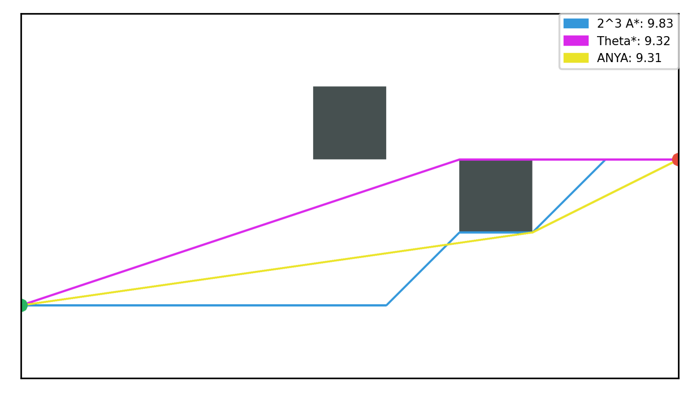
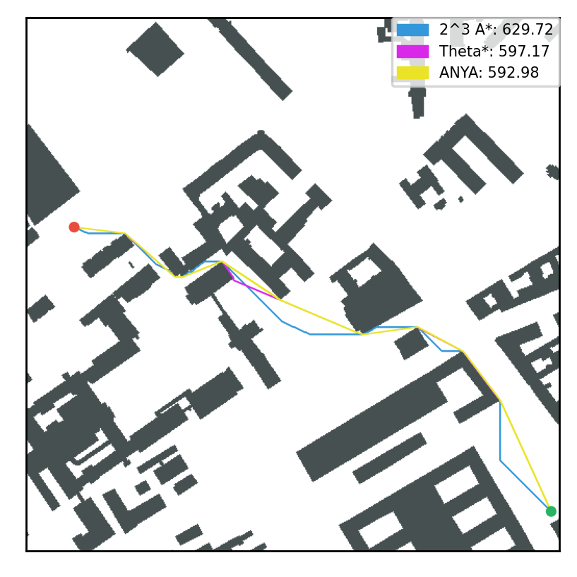
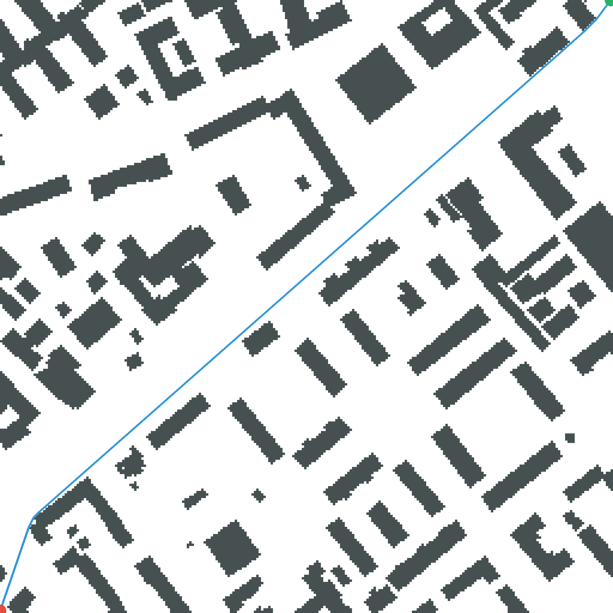

# Any-angle path planning on grid graphs
## Description
This software project was made at St. Petersburg University during project working in Heuristic Algorithms course under the mentorship of Konstantin Sergeevich Yakovlev.

When speaking about path planning on grids, we usually want to simplify task with using some models: for example we can 
limit the number of directions of moves to 4 or 8 etc. and then use one of well-known approaches, for example A* algorithm.

However, when we simplify the model, we have to sacrifice something. In the example above we will find non-optimal
paths. But we can regulate suboptimality coefficient with the number of directions.

This approach is called 2^k A*. You can read more about it in [[1]](#source1).

Other non-optimal but simple and quite effective algorithm is Theta*. 
It's based on the idea of smoothing paths during search.
In this algorithm we try to smooth path from current vertex to parent vertex of our parent and
reduce the path due to this. You can read more in [[2]](#source2).

But the most interesting of the implemented algorithms is ANYA. It is based on A* but it uses another type of nodes: here the node consists of root and an interval visible from it.
This algorithm is optimal and fast enough, but doesn't have such a simple implementation. 
You can read more about this algorithm in [[3]](#source3).

Let's see to the following picture:


It is an example when Theta* can't find optimal path, but as you can see 2^k A* (with parameter k=3) shows an even worse result.

Next picture demonstrates same problem on the bigger map:



## Installing
You can download this project with
```bash
git clone https://github.com/DenisKorotchenko/any-angle-paths-heuristic-search
``` 

## Getting started

You can find path for you personal map. You need to have a file in ```movingai``` format (read more in Inputs and Outputs section) with your own map, or you can use a sample map of Moscow which uses by default.

To find path you just need to move to project directory:
```bash
cd any-angle-paths-heuristic-search
```
and run 
```bash
python3 path-finder.py
```

It has some arguments that you can use:
```bash
  -h, --help            show this help message and exit
  -s, --astar2k         sets 2^k A* as the search algorithm, used by default
  -t, --theta           sets Theta* as the search algorithm
  -a, --anya            sets Anya as the search algorithm
  -k k                  sets 2^k as the limit of possible directions of moves, using in 2^k A* and Theta*, ANYA ignores it, by default 2
  -v, --text-output-only
                        disables graphics
  -f map_file, --map_file map_file
                        filename of the map, by default one of the maps of Moscow is used
  -i start.i start.j goal.i goal.j, --task start.i start.j goal.i goal.j
                        4 integers describing the task, if None then only map will be displayed
```

Let's find a path from (0, 255) to (255, 0) on the default map using ANYA algorithm:
```bash
python3 path-finder.py -a -i 0 255 255 0
```

If you see the following text on the console
```bash
Path found!
Length:  365.32074507207466
0 255
8 249
13 244
21 235
214 16
216 14
220 12
255 0
```
and same picture



then everything is working correctly!

You can also open [```example.ipynb```](https://github.com/DenisKorotchenko/any-angle-paths-heuristic-search/blob/master/example.ipynb) to see some simple examples with a test map 
and run the examples with some pre-downloaded maps from movingai.

## Inputs and Outputs
Our project works with ```movingai``` format, you can read more about format [**here**](https://movingai.com/benchmarks/formats.html).

There are several pre-downloaded maps and tasks in [```test/data```](https://github.com/DenisKorotchenko/any-angle-paths-heuristic-search/tree/master/test/data).

We use 4 packs of maps: city maps, rooms maps, random maps with 10% obstacles and game maps from Warcraft III. 
You can see an example of using these maps in [```example.ipynb```](https://github.com/DenisKorotchenko/any-angle-paths-heuristic-search/blob/master/example.ipynb). 

If you work with [```path-finder.py```](https://github.com/DenisKorotchenko/any-angle-paths-heuristic-search/blob/master/path-finder.py), then you just need to specify filename with map and 
coordinates of start and goal.

The output can be represented in graphics or as a succession of vertexes from the start to the goal.

## Sources
 <a name="source1"></a>
[1] Rivera, N., Hernández, C., Hormazábal, N. and Baier, J.A., 2020. The 2^k Neighborhoods for Grid Path Planning. Journal of Artificial Intelligence Research, 67, pp.81-113.
[**Link**](https://www.jair.org/index.php/jair/article/view/11383)

<a name="source2"></a>
[2] Daniel, K., Nash, A., Koenig, S. and Felner, A., 2010. Theta*: Any-angle path planning on grids. Journal of Artificial Intelligence Research, 39, pp.533-579.
[**Link**](https://www.jair.org/index.php/jair/article/view/10676)

<a name="source3"></a>
[3] Harabor, D.D., Grastien, A., Öz, D. and Aksakalli, V., 2016. Optimal any-angle pathfinding in practice. Journal of Artificial Intelligence Research, 56, pp.89-118.
[**Link**](https://www.researchgate.net/publication/305175423_Optimal_Any-Angle_Pathfinding_In_Practice)
